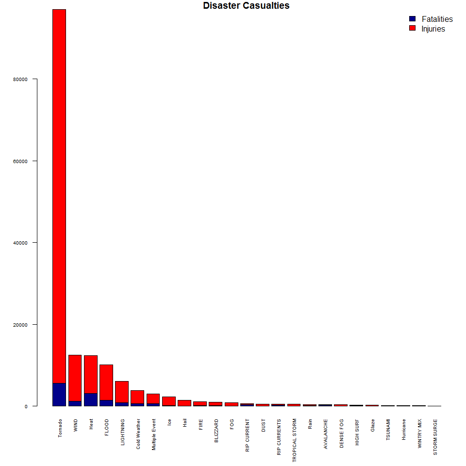
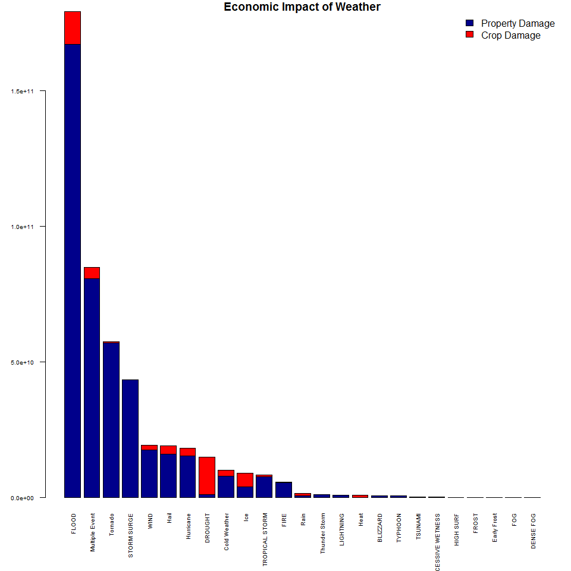

# Storm Data Analysis
W. Aaron Morris  


# Overview
Synopsis: Exploratory Analysis for the Storm Data Analysis

Goals: 1. Identify events that are harmful to the most people.
       2. Identify events that have the greatest finacial impact.


# Import Libraries

```r
library(dplyr)
```

```
## 
## Attaching package: 'dplyr'
```

```
## The following objects are masked from 'package:stats':
## 
##     filter, lag
```

```
## The following objects are masked from 'package:base':
## 
##     intersect, setdiff, setequal, union
```

# Read And Preprocess Data

```r
StormData <- read.csv("data/StormData.csv.bz2")
colnames(StormData)
```

```
##  [1] "STATE__"    "BGN_DATE"   "BGN_TIME"   "TIME_ZONE"  "COUNTY"    
##  [6] "COUNTYNAME" "STATE"      "EVTYPE"     "BGN_RANGE"  "BGN_AZI"   
## [11] "BGN_LOCATI" "END_DATE"   "END_TIME"   "COUNTY_END" "COUNTYENDN"
## [16] "END_RANGE"  "END_AZI"    "END_LOCATI" "LENGTH"     "WIDTH"     
## [21] "F"          "MAG"        "FATALITIES" "INJURIES"   "PROPDMG"   
## [26] "PROPDMGEXP" "CROPDMG"    "CROPDMGEXP" "WFO"        "STATEOFFIC"
## [31] "ZONENAMES"  "LATITUDE"   "LONGITUDE"  "LATITUDE_E" "LONGITUDE_"
## [36] "REMARKS"    "REFNUM"
```

Look through Event Types


```r
event_types <- as.data.frame(table(StormData$EVTYPE))
event_types <- event_types[order(event_types$Var1), ]
event_types
```

```
##                               Var1   Freq
## 1               HIGH SURF ADVISORY      1
## 2                    COASTAL FLOOD      1
## 3                      FLASH FLOOD      1
## 4                        LIGHTNING      1
## 5                        TSTM WIND      4
## 6                  TSTM WIND (G45)      1
## 7                       WATERSPOUT      1
## 8                             WIND      1
## 9                                ?      1
## 10                 ABNORMAL WARMTH      4
## 11                  ABNORMALLY DRY      2
## 12                  ABNORMALLY WET      1
## 13            ACCUMULATED SNOWFALL      4
## 14             AGRICULTURAL FREEZE      6
## 15                   APACHE COUNTY      1
## 16          ASTRONOMICAL HIGH TIDE    103
## 17           ASTRONOMICAL LOW TIDE    174
## 18                        AVALANCE      1
## 19                       AVALANCHE    386
## 20                    BEACH EROSIN      1
## 21                   Beach Erosion      1
## 22                   BEACH EROSION      3
## 23     BEACH EROSION/COASTAL FLOOD      1
## 24                     BEACH FLOOD      2
## 25      BELOW NORMAL PRECIPITATION      2
## 26               BITTER WIND CHILL      1
## 27  BITTER WIND CHILL TEMPERATURES      3
## 28                       Black Ice      3
## 29                       BLACK ICE     14
## 30                        BLIZZARD   2719
## 31  BLIZZARD AND EXTREME WIND CHIL      2
## 32         BLIZZARD AND HEAVY SNOW      1
## 33                Blizzard Summary      1
## 34                BLIZZARD WEATHER      1
## 35          BLIZZARD/FREEZING RAIN      1
## 36             BLIZZARD/HEAVY SNOW      2
## 37              BLIZZARD/HIGH WIND      1
## 38           BLIZZARD/WINTER STORM      1
## 39                   BLOW-OUT TIDE      1
## 40                  BLOW-OUT TIDES      1
## 41                    BLOWING DUST      4
## 42                    blowing snow      2
## 43                    Blowing Snow      3
## 44                    BLOWING SNOW     12
## 45  BLOWING SNOW- EXTREME WIND CHI      1
## 46  BLOWING SNOW & EXTREME WIND CH      2
## 47  BLOWING SNOW/EXTREME WIND CHIL      1
## 48                BREAKUP FLOODING      1
## 49                      BRUSH FIRE      3
## 50                     BRUSH FIRES      1
## 51       COASTAL  FLOODING/EROSION      1
## 52                 COASTAL EROSION      1
## 53                   Coastal Flood      6
## 54                   COASTAL FLOOD    650
## 55                coastal flooding      2
## 56                Coastal Flooding     38
## 57                COASTAL FLOODING    143
## 58        COASTAL FLOODING/EROSION      5
## 59                   Coastal Storm      2
## 60                   COASTAL STORM      8
## 61                   COASTAL SURGE      2
## 62             COASTAL/TIDAL FLOOD      2
## 63                    COASTALFLOOD      1
## 64                    COASTALSTORM      1
## 65                            Cold     10
## 66                            COLD     72
## 67                 COLD AIR FUNNEL      4
## 68                COLD AIR FUNNELS      2
## 69                COLD AIR TORNADO      1
## 70                  Cold and Frost      6
## 71                  COLD AND FROST      1
## 72                   COLD AND SNOW      1
## 73         COLD AND WET CONDITIONS      1
## 74                Cold Temperature      2
## 75               COLD TEMPERATURES      4
## 76                       COLD WAVE      3
## 77                    COLD WEATHER      4
## 78    COLD WIND CHILL TEMPERATURES      6
## 79                 COLD/WIND CHILL    539
## 80                      COLD/WINDS      1
## 81                    COOL AND WET      1
## 82                      COOL SPELL      1
## 83           CSTL FLOODING/EROSION      2
## 84                       DAM BREAK      4
## 85                     DAM FAILURE      1
## 86                 Damaging Freeze      2
## 87                 DAMAGING FREEZE      6
## 88                       DEEP HAIL      1
## 89                       DENSE FOG   1293
## 90                     DENSE SMOKE     10
## 91                       DOWNBURST      2
## 92                 DOWNBURST WINDS      2
## 93                    DRIEST MONTH      1
## 94                   Drifting Snow      1
## 95                         DROUGHT   2488
## 96          DROUGHT/EXCESSIVE HEAT     13
## 97                        DROWNING      1
## 98                             DRY      9
## 99                  DRY CONDITIONS      6
## 100                DRY HOT WEATHER      1
## 101                 DRY MICROBURST    186
## 102              DRY MICROBURST 50      1
## 103              DRY MICROBURST 53      1
## 104              DRY MICROBURST 58      2
## 105              DRY MICROBURST 61      1
## 106              DRY MICROBURST 84      1
## 107           DRY MICROBURST WINDS      5
## 108           DRY MIRCOBURST WINDS      1
## 109                    DRY PATTERN      1
## 110                      DRY SPELL      4
## 111                    DRY WEATHER      4
## 112                        DRYNESS      1
## 113                     DUST DEVEL      1
## 114                     Dust Devil      8
## 115                     DUST DEVIL    141
## 116          DUST DEVIL WATERSPOUT      1
## 117                     DUST STORM    427
## 118          DUST STORM/HIGH WINDS      1
## 119                      DUSTSTORM      1
## 120                   EARLY FREEZE      1
## 121                    Early Frost      1
## 122                    EARLY FROST      1
## 123                     EARLY RAIN      1
## 124                     EARLY SNOW      3
## 125                 Early snowfall      2
## 126                 EARLY SNOWFALL      5
## 127             Erosion/Cstl Flood      2
## 128                      EXCESSIVE      1
## 129                 Excessive Cold      2
## 130                 EXCESSIVE HEAT   1678
## 131         EXCESSIVE HEAT/DROUGHT      1
## 132        EXCESSIVE PRECIPITATION      1
## 133                 EXCESSIVE RAIN      5
## 134             EXCESSIVE RAINFALL      4
## 135                 EXCESSIVE SNOW     25
## 136              EXCESSIVE WETNESS      1
## 137                EXCESSIVELY DRY      1
## 138                  Extended Cold      1
## 139                   Extreme Cold      2
## 140                   EXTREME COLD    655
## 141        EXTREME COLD/WIND CHILL   1002
## 142                   EXTREME HEAT     22
## 143             EXTREME WIND CHILL      6
## 144 EXTREME WIND CHILL/BLOWING SNO      1
## 145            EXTREME WIND CHILLS      1
## 146              EXTREME WINDCHILL    204
## 147 EXTREME WINDCHILL TEMPERATURES     19
## 148            EXTREME/RECORD COLD      4
## 149                  EXTREMELY WET      1
## 150               FALLING SNOW/ICE      2
## 151                    FIRST FROST      1
## 152                     FIRST SNOW      9
## 153                    FLASH FLOOD  54277
## 154       FLASH FLOOD - HEAVY RAIN      2
## 155      FLASH FLOOD FROM ICE JAMS      5
## 156         FLASH FLOOD LANDSLIDES      1
## 157              FLASH FLOOD WINDS      1
## 158                   FLASH FLOOD/      1
## 159             FLASH FLOOD/ FLOOD      2
## 160            FLASH FLOOD/ STREET      1
## 161              FLASH FLOOD/FLOOD     22
## 162         FLASH FLOOD/HEAVY RAIN      1
## 163          FLASH FLOOD/LANDSLIDE      1
## 164                 FLASH FLOODING    682
## 165           FLASH FLOODING/FLOOD      8
## 166 FLASH FLOODING/THUNDERSTORM WI      1
## 167                   FLASH FLOODS     32
## 168                FLASH FLOOODING      1
## 169                          Flood      1
## 170                          FLOOD  25326
## 171             FLOOD & HEAVY RAIN      2
## 172                    FLOOD FLASH      3
## 173              FLOOD FLOOD/FLASH      1
## 174                   FLOOD WATCH/      1
## 175                    FLOOD/FLASH      2
## 176              Flood/Flash Flood      1
## 177              FLOOD/FLASH FLOOD    624
## 178           FLOOD/FLASH FLOODING      2
## 179              FLOOD/FLASH/FLOOD      1
## 180               FLOOD/FLASHFLOOD      1
## 181                FLOOD/RAIN/WIND      1
## 182               FLOOD/RAIN/WINDS      6
## 183              FLOOD/RIVER FLOOD      1
## 184              Flood/Strong Wind      1
## 185                       FLOODING    120
## 186            FLOODING/HEAVY RAIN      1
## 187                         FLOODS      3
## 188                            FOG    538
## 189      FOG AND COLD TEMPERATURES      1
## 190                   FOREST FIRES      1
## 191                         Freeze      2
## 192                         FREEZE     74
## 193               Freezing drizzle      1
## 194               Freezing Drizzle      3
## 195               FREEZING DRIZZLE     20
## 196  FREEZING DRIZZLE AND FREEZING      1
## 197                   Freezing Fog      1
## 198                   FREEZING FOG     45
## 199                  Freezing rain      3
## 200                  Freezing Rain      7
## 201                  FREEZING RAIN    250
## 202        FREEZING RAIN AND SLEET      6
## 203         FREEZING RAIN AND SNOW      1
## 204        FREEZING RAIN SLEET AND      1
## 205  FREEZING RAIN SLEET AND LIGHT      1
## 206            FREEZING RAIN/SLEET      9
## 207             FREEZING RAIN/SNOW      4
## 208                 Freezing Spray      1
## 209                          Frost      4
## 210                          FROST     53
## 211                   Frost/Freeze      1
## 212                   FROST/FREEZE   1342
## 213                  FROST\\FREEZE      1
## 214                         FUNNEL     46
## 215                   Funnel Cloud      5
## 216                   FUNNEL CLOUD   6839
## 217                  FUNNEL CLOUD.      1
## 218              FUNNEL CLOUD/HAIL      1
## 219                  FUNNEL CLOUDS     87
## 220                        FUNNELS      1
## 221                          Glaze     11
## 222                          GLAZE     32
## 223                      GLAZE ICE      2
## 224                GLAZE/ICE STORM      1
## 225                  gradient wind      2
## 226                  Gradient wind      4
## 227                  GRADIENT WIND      3
## 228                 GRADIENT WINDS      8
## 229                    GRASS FIRES      1
## 230                GROUND BLIZZARD      2
## 231                       GUSTNADO      6
## 232                   GUSTNADO AND      1
## 233                GUSTY LAKE WIND      1
## 234        GUSTY THUNDERSTORM WIND      3
## 235       GUSTY THUNDERSTORM WINDS      5
## 236                     Gusty Wind      1
## 237                     GUSTY WIND     23
## 238                GUSTY WIND/HAIL      1
## 239            GUSTY WIND/HVY RAIN      1
## 240                Gusty wind/rain      1
## 241                    Gusty winds      2
## 242                    Gusty Winds     10
## 243                    GUSTY WINDS     53
## 244                           HAIL 288661
## 245                      HAIL 0.75     18
## 246                      HAIL 0.88      1
## 247                       HAIL 075      1
## 248                       HAIL 088      1
## 249                      HAIL 1.00      6
## 250                      HAIL 1.75      4
## 251                     HAIL 1.75)      1
## 252                       HAIL 100     13
## 253                       HAIL 125      1
## 254                       HAIL 150      2
## 255                       HAIL 175     13
## 256                       HAIL 200      1
## 257                       HAIL 225      1
## 258                       HAIL 275      3
## 259                       HAIL 450      1
## 260                        HAIL 75     29
## 261                        HAIL 80      2
## 262                        HAIL 88      1
## 263                     HAIL ALOFT      1
## 264                    HAIL DAMAGE      2
## 265                  HAIL FLOODING      1
## 266                     HAIL STORM      1
## 267                     Hail(0.75)      1
## 268                 HAIL/ICY ROADS      1
## 269                      HAIL/WIND      3
## 270                     HAIL/WINDS      2
## 271                      HAILSTORM      3
## 272                     HAILSTORMS      1
## 273                    HARD FREEZE      7
## 274                 HAZARDOUS SURF      1
## 275                           HEAT    767
## 276                   HEAT DROUGHT      1
## 277                      Heat Wave      1
## 278                      HEAT WAVE     74
## 279              HEAT WAVE DROUGHT      1
## 280                     HEAT WAVES      2
## 281                   HEAT/DROUGHT      1
## 282                      Heatburst      1
## 283                HEAVY LAKE SNOW     25
## 284                      HEAVY MIX      8
## 285            HEAVY PRECIPATATION      1
## 286            Heavy Precipitation      2
## 287            HEAVY PRECIPITATION      1
## 288                     Heavy rain      3
## 289                     Heavy Rain     16
## 290                     HEAVY RAIN  11723
## 291           HEAVY RAIN AND FLOOD      1
## 292            Heavy Rain and Wind      4
## 293             HEAVY RAIN EFFECTS      1
## 294            HEAVY RAIN/FLOODING      2
## 295           Heavy Rain/High Surf      1
## 296           HEAVY RAIN/LIGHTNING      1
## 297     HEAVY RAIN/MUDSLIDES/FLOOD      1
## 298      HEAVY RAIN/SEVERE WEATHER      2
## 299  HEAVY RAIN/SMALL STREAM URBAN      1
## 300                HEAVY RAIN/SNOW      1
## 301         HEAVY RAIN/URBAN FLOOD      1
## 302                HEAVY RAIN/WIND      4
## 303 HEAVY RAIN; URBAN FLOOD WINDS;      1
## 304                 HEAVY RAINFALL      3
## 305                    HEAVY RAINS     26
## 306           HEAVY RAINS/FLOODING      9
## 307                     HEAVY SEAS      2
## 308                   HEAVY SHOWER      2
## 309                  HEAVY SHOWERS      1
## 310                     HEAVY SNOW  15708
## 311             HEAVY SNOW-SQUALLS     15
## 312     HEAVY SNOW   FREEZING RAIN      1
## 313               HEAVY SNOW & ICE      1
## 314                 HEAVY SNOW AND      1
## 315      HEAVY SNOW AND HIGH WINDS      2
## 316             HEAVY SNOW AND ICE      2
## 317       HEAVY SNOW AND ICE STORM      2
## 318    HEAVY SNOW AND STRONG WINDS      1
## 319     HEAVY SNOW ANDBLOWING SNOW      1
## 320              Heavy snow shower      1
## 321             HEAVY SNOW SQUALLS     32
## 322            HEAVY SNOW/BLIZZARD      3
## 323  HEAVY SNOW/BLIZZARD/AVALANCHE      1
## 324        HEAVY SNOW/BLOWING SNOW      1
## 325       HEAVY SNOW/FREEZING RAIN      2
## 326                HEAVY SNOW/HIGH      1
## 327           HEAVY SNOW/HIGH WIND      1
## 328          HEAVY SNOW/HIGH WINDS      1
## 329  HEAVY SNOW/HIGH WINDS & FLOOD      1
## 330 HEAVY SNOW/HIGH WINDS/FREEZING      1
## 331                 HEAVY SNOW/ICE      5
## 332           HEAVY SNOW/ICE STORM      2
## 333               HEAVY SNOW/SLEET      1
## 334             HEAVY SNOW/SQUALLS      2
## 335                HEAVY SNOW/WIND      1
## 336        HEAVY SNOW/WINTER STORM      1
## 337                 HEAVY SNOWPACK      1
## 338                     Heavy Surf      3
## 339                     HEAVY SURF     84
## 340            Heavy surf and wind      1
## 341    HEAVY SURF COASTAL FLOODING      1
## 342           HEAVY SURF/HIGH SURF    228
## 343                   HEAVY SWELLS      1
## 344                 HEAVY WET SNOW      1
## 345                           HIGH      1
## 346                   HIGH  SWELLS      1
## 347                    HIGH  WINDS      1
## 348                      HIGH SEAS      8
## 349                      High Surf      9
## 350                      HIGH SURF    725
## 351           HIGH SURF ADVISORIES      1
## 352             HIGH SURF ADVISORY      4
## 353                    HIGH SWELLS      5
## 354        HIGH TEMPERATURE RECORD      3
## 355                     HIGH TIDES      2
## 356                     HIGH WATER      6
## 357                     HIGH WAVES      3
## 358                      High Wind      2
## 359                      HIGH WIND  20212
## 360                HIGH WIND (G40)      2
## 361                   HIGH WIND 48      1
## 362                   HIGH WIND 63      1
## 363                   HIGH WIND 70      1
## 364       HIGH WIND AND HEAVY SNOW      1
## 365       HIGH WIND AND HIGH TIDES      2
## 366             HIGH WIND AND SEAS      1
## 367               HIGH WIND DAMAGE      2
## 368            HIGH WIND/ BLIZZARD      1
## 369             HIGH WIND/BLIZZARD      6
## 370 HIGH WIND/BLIZZARD/FREEZING RA      1
## 371           HIGH WIND/HEAVY SNOW      3
## 372       HIGH WIND/LOW WIND CHILL      1
## 373                 HIGH WIND/SEAS      1
## 374           HIGH WIND/WIND CHILL      1
## 375  HIGH WIND/WIND CHILL/BLIZZARD      1
## 376                     HIGH WINDS   1533
## 377                  HIGH WINDS 55      1
## 378                  HIGH WINDS 57      1
## 379                  HIGH WINDS 58      1
## 380                  HIGH WINDS 63      2
## 381                  HIGH WINDS 66      2
## 382                  HIGH WINDS 67      1
## 383                  HIGH WINDS 73      1
## 384                  HIGH WINDS 76      1
## 385                  HIGH WINDS 80      2
## 386                  HIGH WINDS 82      1
## 387      HIGH WINDS AND WIND CHILL      1
## 388          HIGH WINDS DUST STORM      1
## 389         HIGH WINDS HEAVY RAINS      1
## 390                    HIGH WINDS/      1
## 391       HIGH WINDS/COASTAL FLOOD      1
## 392                HIGH WINDS/COLD      5
## 393            HIGH WINDS/FLOODING      1
## 394          HIGH WINDS/HEAVY RAIN      1
## 395                HIGH WINDS/SNOW      3
## 396               HIGHWAY FLOODING      1
## 397                    Hot and Dry      2
## 398                    HOT PATTERN      1
## 399                      HOT SPELL      2
## 400                    HOT WEATHER      1
## 401                HOT/DRY PATTERN      1
## 402                      HURRICANE    174
## 403     HURRICANE-GENERATED SWELLS      3
## 404              Hurricane Edouard      2
## 405                HURRICANE EMILY      1
## 406                 HURRICANE ERIN      7
## 407                HURRICANE FELIX      2
## 408               HURRICANE GORDON      1
## 409                 HURRICANE OPAL      9
## 410      HURRICANE OPAL/HIGH WINDS      1
## 411              HURRICANE/TYPHOON     88
## 412                       HVY RAIN      2
## 413          HYPERTHERMIA/EXPOSURE      1
## 414                    HYPOTHERMIA      1
## 415           Hypothermia/Exposure      3
## 416           HYPOTHERMIA/EXPOSURE      3
## 417                            ICE     61
## 418                   ICE AND SNOW      1
## 419                      ICE FLOES      2
## 420                        Ice Fog      2
## 421                        ICE JAM      4
## 422           Ice jam flood (minor      1
## 423               ICE JAM FLOODING      5
## 424                    ICE ON ROAD      1
## 425                    ICE PELLETS      1
## 426                      ICE ROADS      1
## 427                      ICE STORM   2006
## 428             ICE STORM AND SNOW      1
## 429          ICE STORM/FLASH FLOOD      1
## 430                       Ice/Snow      2
## 431                       ICE/SNOW      3
## 432               ICE/STRONG WINDS      1
## 433              Icestorm/Blizzard      1
## 434                      Icy Roads      4
## 435                      ICY ROADS     28
## 436                   LACK OF SNOW      1
## 437               LAKE-EFFECT SNOW    636
## 438               Lake Effect Snow      2
## 439               LAKE EFFECT SNOW     21
## 440                     LAKE FLOOD      1
## 441                LAKESHORE FLOOD     23
## 442                      LANDSLIDE    600
## 443          LANDSLIDE/URBAN FLOOD      1
## 444                     LANDSLIDES      8
## 445                      Landslump      1
## 446                      LANDSLUMP      1
## 447                      LANDSPOUT      2
## 448               LARGE WALL CLOUD      1
## 449           Late-season Snowfall      1
## 450                    LATE FREEZE      1
## 451               LATE SEASON HAIL      1
## 452               LATE SEASON SNOW      1
## 453           Late Season Snowfall      2
## 454                      LATE SNOW      2
## 455            LIGHT FREEZING RAIN     23
## 456                     Light snow      1
## 457                     Light Snow     21
## 458                     LIGHT SNOW    154
## 459           LIGHT SNOW AND SLEET      2
## 460            Light Snow/Flurries      3
## 461     LIGHT SNOW/FREEZING PRECIP      1
## 462                 Light Snowfall      1
## 463                       LIGHTING      3
## 464                      LIGHTNING  15754
## 465             LIGHTNING  WAUSEON      1
## 466       LIGHTNING AND HEAVY RAIN      1
## 467 LIGHTNING AND THUNDERSTORM WIN      1
## 468            LIGHTNING AND WINDS      1
## 469               LIGHTNING DAMAGE      1
## 470                 LIGHTNING FIRE      1
## 471               LIGHTNING INJURY      1
## 472   LIGHTNING THUNDERSTORM WINDS      1
## 473  LIGHTNING THUNDERSTORM WINDSS      1
## 474                     LIGHTNING.      1
## 475           LIGHTNING/HEAVY RAIN      1
## 476                      LIGNTNING      1
## 477              LOCAL FLASH FLOOD      1
## 478                    LOCAL FLOOD      1
## 479             LOCALLY HEAVY RAIN      1
## 480                LOW TEMPERATURE      7
## 481         LOW TEMPERATURE RECORD      1
## 482                 LOW WIND CHILL      1
## 483                    MAJOR FLOOD      3
## 484                Marine Accident      1
## 485                    MARINE HAIL    442
## 486               MARINE HIGH WIND    135
## 487                  MARINE MISHAP      2
## 488             MARINE STRONG WIND     48
## 489       MARINE THUNDERSTORM WIND   5812
## 490               MARINE TSTM WIND   6175
## 491            Metro Storm, May 26      1
## 492                     Microburst      4
## 493                     MICROBURST      5
## 494               MICROBURST WINDS      5
## 495           Mild and Dry Pattern      1
## 496                   MILD PATTERN      1
## 497               MILD/DRY PATTERN      1
## 498                    MINOR FLOOD      1
## 499                 Minor Flooding      1
## 500                 MINOR FLOODING      3
## 501                   MIXED PRECIP     10
## 502            Mixed Precipitation      3
## 503            MIXED PRECIPITATION     34
## 504                  MODERATE SNOW      1
## 505              MODERATE SNOWFALL    101
## 506          MONTHLY PRECIPITATION     36
## 507               Monthly Rainfall      2
## 508               MONTHLY RAINFALL     11
## 509               Monthly Snowfall      1
## 510               MONTHLY SNOWFALL      1
## 511            MONTHLY TEMPERATURE      4
## 512                 Mountain Snows      1
## 513                      MUD SLIDE      7
## 514                     MUD SLIDES      1
## 515      MUD SLIDES URBAN FLOODING      1
## 516                 MUD/ROCK SLIDE      1
## 517                       Mudslide      8
## 518                       MUDSLIDE      9
## 519             MUDSLIDE/LANDSLIDE      1
## 520                      Mudslides      5
## 521                      MUDSLIDES      4
## 522               NEAR RECORD SNOW      1
## 523              No Severe Weather      1
## 524         NON-SEVERE WIND DAMAGE      1
## 525                  NON-TSTM WIND      1
## 526                NON SEVERE HAIL      7
## 527                  NON TSTM WIND      2
## 528                           NONE      2
## 529           NORMAL PRECIPITATION      3
## 530                NORTHERN LIGHTS      1
## 531                          Other      4
## 532                          OTHER     48
## 533               PATCHY DENSE FOG      3
## 534                     PATCHY ICE      1
## 535                   Prolong Cold      5
## 536                   PROLONG COLD     17
## 537              PROLONG COLD/SNOW      1
## 538                 PROLONG WARMTH      4
## 539                 PROLONGED RAIN      4
## 540                           RAIN     16
## 541                   RAIN (HEAVY)      1
## 542                  RAIN AND WIND      1
## 543                    Rain Damage      1
## 544                      RAIN/SNOW      5
## 545                      RAIN/WIND      1
## 546                      RAINSTORM      1
## 547           RAPIDLY RISING WATER      1
## 548                   RECORD  COLD      1
## 549                    Record Cold      3
## 550                    RECORD COLD     64
## 551      RECORD COLD AND HIGH WIND      1
## 552              RECORD COLD/FROST      2
## 553                    RECORD COOL      5
## 554               Record dry month      1
## 555                 RECORD DRYNESS      2
## 556                    Record Heat      1
## 557                    RECORD HEAT     81
## 558               RECORD HEAT WAVE      1
## 559                    Record High      2
## 560                    RECORD HIGH      5
## 561        RECORD HIGH TEMPERATURE      3
## 562       RECORD HIGH TEMPERATURES      1
## 563                     RECORD LOW      4
## 564            RECORD LOW RAINFALL      2
## 565                Record May Snow      1
## 566           RECORD PRECIPITATION      1
## 567                RECORD RAINFALL     14
## 568                    RECORD SNOW      8
## 569               RECORD SNOW/COLD      1
## 570                RECORD SNOWFALL      6
## 571             Record temperature     11
## 572             RECORD TEMPERATURE      5
## 573            Record Temperatures      2
## 574            RECORD TEMPERATURES      3
## 575                    RECORD WARM      1
## 576             RECORD WARM TEMPS.      1
## 577                  Record Warmth      8
## 578                  RECORD WARMTH    146
## 579             Record Winter Snow      3
## 580          RECORD/EXCESSIVE HEAT      3
## 581      RECORD/EXCESSIVE RAINFALL      1
## 582              RED FLAG CRITERIA      2
## 583               RED FLAG FIRE WX      2
## 584              REMNANTS OF FLOYD      2
## 585                    RIP CURRENT    470
## 586                   RIP CURRENTS    304
## 587        RIP CURRENTS HEAVY SURF      1
## 588        RIP CURRENTS/HEAVY SURF      2
## 589         RIVER AND STREAM FLOOD      2
## 590                    RIVER FLOOD    173
## 591                 River Flooding      5
## 592                 RIVER FLOODING     24
## 593                     ROCK SLIDE      2
## 594                     ROGUE WAVE      1
## 595            ROTATING WALL CLOUD      5
## 596                     ROUGH SEAS      3
## 597                     ROUGH SURF      4
## 598                    RURAL FLOOD      2
## 599                   Saharan Dust      2
## 600                   SAHARAN DUST      2
## 601              Seasonal Snowfall      1
## 602                         SEICHE     21
## 603                    SEVERE COLD      1
## 604            SEVERE THUNDERSTORM     13
## 605      SEVERE THUNDERSTORM WINDS      5
## 606           SEVERE THUNDERSTORMS     23
## 607              SEVERE TURBULENCE      1
## 608                          SLEET     59
## 609          SLEET & FREEZING RAIN      1
## 610                    SLEET STORM     12
## 611            SLEET/FREEZING RAIN      2
## 612                SLEET/ICE STORM      1
## 613                SLEET/RAIN/SNOW      1
## 614                     SLEET/SNOW      2
## 615                     small hail      5
## 616                     Small Hail      1
## 617                     SMALL HAIL     47
## 618                   SMALL STREAM      1
## 619               SMALL STREAM AND      1
## 620   SMALL STREAM AND URBAN FLOOD      2
## 621 SMALL STREAM AND URBAN FLOODIN      1
## 622             SMALL STREAM FLOOD      7
## 623          SMALL STREAM FLOODING      4
## 624       SMALL STREAM URBAN FLOOD      1
## 625       SMALL STREAM/URBAN FLOOD      5
## 626                 Sml Stream Fld      2
## 627                          SMOKE     11
## 628                           Snow     30
## 629                           SNOW    587
## 630    SNOW- HIGH WIND- WIND CHILL      1
## 631              Snow Accumulation      1
## 632              SNOW ACCUMULATION      1
## 633                  SNOW ADVISORY      1
## 634                  SNOW AND COLD      2
## 635            SNOW AND HEAVY SNOW      2
## 636                   Snow and Ice      1
## 637                   SNOW AND ICE     33
## 638             SNOW AND ICE STORM      1
## 639                 Snow and sleet      1
## 640                 SNOW AND SLEET      4
## 641                  SNOW AND WIND      1
## 642                   SNOW DROUGHT      7
## 643             SNOW FREEZING RAIN     11
## 644                   SNOW SHOWERS      6
## 645                     SNOW SLEET      1
## 646                    SNOW SQUALL     19
## 647                   Snow squalls      1
## 648                   Snow Squalls      4
## 649                   SNOW SQUALLS     17
## 650              SNOW/ BITTER COLD      1
## 651                      SNOW/ ICE      1
## 652              SNOW/BLOWING SNOW      7
## 653                      SNOW/COLD      2
## 654             SNOW/FREEZING RAIN      6
## 655                SNOW/HEAVY SNOW      1
## 656                SNOW/HIGH WINDS      2
## 657                       SNOW/ICE      7
## 658                 SNOW/ICE STORM     17
## 659                      SNOW/RAIN      1
## 660                SNOW/RAIN/SLEET      1
## 661                     SNOW/SLEET     10
## 662       SNOW/SLEET/FREEZING RAIN      6
## 663                SNOW/SLEET/RAIN      1
## 664                     SNOW\\COLD      1
## 665                SNOWFALL RECORD      1
## 666              SNOWMELT FLOODING      5
## 667                      SNOWSTORM      1
## 668                      SOUTHEAST      1
## 669              STORM FORCE WINDS      1
## 670                    STORM SURGE    261
## 671               STORM SURGE/TIDE    148
## 672                STREAM FLOODING      1
## 673                   STREET FLOOD      3
## 674                STREET FLOODING      3
## 675                    Strong Wind      3
## 676                    STRONG WIND   3566
## 677               STRONG WIND GUST      2
## 678                   Strong winds      1
## 679                   Strong Winds      7
## 680                   STRONG WINDS    196
## 681              Summary August 10      2
## 682              Summary August 11      2
## 683              Summary August 17      1
## 684             Summary August 2-3      1
## 685              Summary August 21      1
## 686              Summary August 28      1
## 687               Summary August 4      1
## 688               Summary August 7      1
## 689               Summary August 9      1
## 690                 Summary Jan 17      1
## 691             Summary July 23-24      1
## 692             Summary June 18-19      1
## 693               Summary June 5-6      1
## 694                 Summary June 6      1
## 695            Summary of April 12      2
## 696            Summary of April 13      1
## 697            Summary of April 21      2
## 698            Summary of April 27      1
## 699           Summary of April 3rd      1
## 700            Summary of August 1      1
## 701             Summary of July 11      1
## 702              Summary of July 2      1
## 703             Summary of July 22      1
## 704             Summary of July 26      1
## 705             Summary of July 29      1
## 706              Summary of July 3      1
## 707             Summary of June 10      1
## 708             Summary of June 11      1
## 709             Summary of June 12      1
## 710             Summary of June 13      2
## 711             Summary of June 15      1
## 712             Summary of June 16      1
## 713             Summary of June 18      1
## 714             Summary of June 23      1
## 715             Summary of June 24      1
## 716              Summary of June 3      2
## 717             Summary of June 30      1
## 718              Summary of June 4      1
## 719              Summary of June 6      1
## 720            Summary of March 14      1
## 721            Summary of March 23      2
## 722            Summary of March 24      1
## 723         SUMMARY OF MARCH 24-25      1
## 724            SUMMARY OF MARCH 27      1
## 725            SUMMARY OF MARCH 29      1
## 726              Summary of May 10      1
## 727              Summary of May 13      1
## 728              Summary of May 14      1
## 729              Summary of May 22      1
## 730           Summary of May 22 am      1
## 731           Summary of May 22 pm      1
## 732           Summary of May 26 am      1
## 733           Summary of May 26 pm      1
## 734           Summary of May 31 am      1
## 735           Summary of May 31 pm      1
## 736            Summary of May 9-10      1
## 737            Summary Sept. 25-26      1
## 738           Summary September 20      1
## 739           Summary September 23      2
## 740            Summary September 3      1
## 741            Summary September 4      1
## 742               Summary: Nov. 16      2
## 743              Summary: Nov. 6-7      1
## 744            Summary: Oct. 20-21      1
## 745            Summary: October 31      1
## 746              Summary: Sept. 18      1
## 747             Temperature record     43
## 748              THUDERSTORM WINDS      2
## 749            THUNDEERSTORM WINDS      2
## 750            THUNDERESTORM WINDS      1
## 751                    THUNDERSNOW      1
## 752             Thundersnow shower      1
## 753                   THUNDERSTORM     45
## 754            THUNDERSTORM  WINDS      7
## 755            THUNDERSTORM DAMAGE      2
## 756         THUNDERSTORM DAMAGE TO      1
## 757              THUNDERSTORM HAIL      1
## 758            THUNDERSTORM W INDS      1
## 759              Thunderstorm Wind      1
## 760              THUNDERSTORM WIND  82563
## 761        THUNDERSTORM WIND (G40)      1
## 762           THUNDERSTORM WIND 50      2
## 763           THUNDERSTORM WIND 52      1
## 764           THUNDERSTORM WIND 56      1
## 765           THUNDERSTORM WIND 59      1
## 766       THUNDERSTORM WIND 59 MPH      1
## 767      THUNDERSTORM WIND 59 MPH.      1
## 768       THUNDERSTORM WIND 60 MPH      4
## 769       THUNDERSTORM WIND 65 MPH      1
## 770        THUNDERSTORM WIND 65MPH      1
## 771           THUNDERSTORM WIND 69      1
## 772       THUNDERSTORM WIND 98 MPH      1
## 773          THUNDERSTORM WIND G50      4
## 774          THUNDERSTORM WIND G51      1
## 775          THUNDERSTORM WIND G52      2
## 776          THUNDERSTORM WIND G55      1
## 777          THUNDERSTORM WIND G60      2
## 778          THUNDERSTORM WIND G61      1
## 779        THUNDERSTORM WIND TREES      1
## 780             THUNDERSTORM WIND.      1
## 781        THUNDERSTORM WIND/ TREE      1
## 782       THUNDERSTORM WIND/ TREES      4
## 783       THUNDERSTORM WIND/AWNING      1
## 784         THUNDERSTORM WIND/HAIL      1
## 785    THUNDERSTORM WIND/LIGHTNING      1
## 786             THUNDERSTORM WINDS  20843
## 787 THUNDERSTORM WINDS      LE CEN      1
## 788          THUNDERSTORM WINDS 13      1
## 789           THUNDERSTORM WINDS 2      1
## 790          THUNDERSTORM WINDS 50      1
## 791          THUNDERSTORM WINDS 52      1
## 792          THUNDERSTORM WINDS 53      1
## 793          THUNDERSTORM WINDS 60      1
## 794          THUNDERSTORM WINDS 61      1
## 795          THUNDERSTORM WINDS 62      1
## 796      THUNDERSTORM WINDS 63 MPH      1
## 797         THUNDERSTORM WINDS AND      2
## 798 THUNDERSTORM WINDS FUNNEL CLOU      2
## 799           THUNDERSTORM WINDS G      2
## 800         THUNDERSTORM WINDS G60      1
## 801        THUNDERSTORM WINDS HAIL     61
## 802  THUNDERSTORM WINDS HEAVY RAIN      1
## 803   THUNDERSTORM WINDS LIGHTNING      7
## 804 THUNDERSTORM WINDS SMALL STREA      1
## 805 THUNDERSTORM WINDS URBAN FLOOD      1
## 806            THUNDERSTORM WINDS.      3
## 807      THUNDERSTORM WINDS/ FLOOD      2
## 808       THUNDERSTORM WINDS/ HAIL      1
## 809 THUNDERSTORM WINDS/FLASH FLOOD      1
## 810    THUNDERSTORM WINDS/FLOODING      1
## 811 THUNDERSTORM WINDS/FUNNEL CLOU      1
## 812        THUNDERSTORM WINDS/HAIL     24
## 813  THUNDERSTORM WINDS/HEAVY RAIN      1
## 814           THUNDERSTORM WINDS53      1
## 815         THUNDERSTORM WINDSHAIL      1
## 816            THUNDERSTORM WINDSS     51
## 817              THUNDERSTORM WINS      1
## 818                  THUNDERSTORMS      4
## 819             THUNDERSTORMS WIND      6
## 820            THUNDERSTORMS WINDS     14
## 821                  THUNDERSTORMW      1
## 822               THUNDERSTORMW 50      1
## 823            THUNDERSTORMW WINDS      3
## 824              THUNDERSTORMWINDS      1
## 825              THUNDERSTROM WIND      1
## 826             THUNDERSTROM WINDS      2
## 827              THUNDERTORM WINDS      3
## 828              THUNDERTSORM WIND      1
## 829              THUNDESTORM WINDS      2
## 830              THUNERSTORM WINDS      1
## 831                    TIDAL FLOOD      1
## 832                 Tidal Flooding      5
## 833                 TIDAL FLOODING     20
## 834                        TORNADO  60652
## 835                 TORNADO DEBRIS      1
## 836                     TORNADO F0     19
## 837                     TORNADO F1      4
## 838                     TORNADO F2      3
## 839                     TORNADO F3      2
## 840             TORNADO/WATERSPOUT      1
## 841                      TORNADOES      2
## 842     TORNADOES, TSTM WIND, HAIL      1
## 843                       TORNADOS      1
## 844                        TORNDAO      1
## 845                TORRENTIAL RAIN      1
## 846            Torrential Rainfall      1
## 847            TROPICAL DEPRESSION     60
## 848                 TROPICAL STORM    690
## 849         TROPICAL STORM ALBERTO      1
## 850            TROPICAL STORM DEAN      2
## 851          TROPICAL STORM GORDON      1
## 852           TROPICAL STORM JERRY      3
## 853                           TSTM      1
## 854                TSTM HEAVY RAIN      3
## 855                      Tstm Wind      2
## 856                      TSTM WIND 219940
## 857               TSTM WIND  (G45)      1
## 858                 TSTM WIND (41)      1
## 859                TSTM WIND (G35)      1
## 860                TSTM WIND (G40)     10
## 861                TSTM WIND (G45)     39
## 862                   TSTM WIND 40      1
## 863                   TSTM WIND 45      1
## 864                   TSTM WIND 50      1
## 865                   TSTM WIND 51      2
## 866                   TSTM WIND 52      5
## 867                   TSTM WIND 55      3
## 868                  TSTM WIND 65)      1
## 869        TSTM WIND AND LIGHTNING      1
## 870               TSTM WIND DAMAGE      1
## 871                  TSTM WIND G45      1
## 872                  TSTM WIND G58      1
## 873                 TSTM WIND/HAIL   1028
## 874                     TSTM WINDS      6
## 875                       TSTM WND      1
## 876                          TSTMW      1
## 877                        TSUNAMI     20
## 878               TUNDERSTORM WIND      1
## 879                        TYPHOON     11
## 880              Unseasonable Cold      1
## 881              UNSEASONABLY COLD     23
## 882              UNSEASONABLY COOL     12
## 883        UNSEASONABLY COOL & WET      2
## 884               UNSEASONABLY DRY     56
## 885               UNSEASONABLY HOT     10
## 886              UNSEASONABLY WARM    126
## 887        UNSEASONABLY WARM & WET      1
## 888      UNSEASONABLY WARM AND DRY     13
## 889         UNSEASONABLY WARM YEAR      2
## 890          UNSEASONABLY WARM/WET      2
## 891               UNSEASONABLY WET     19
## 892            UNSEASONAL LOW TEMP      2
## 893                UNSEASONAL RAIN      2
## 894                 UNUSUAL WARMTH     10
## 895          UNUSUAL/RECORD WARMTH      2
## 896                 UNUSUALLY COLD      8
## 897            UNUSUALLY LATE SNOW      1
## 898                 UNUSUALLY WARM      4
## 899                URBAN AND SMALL      2
## 900         URBAN AND SMALL STREAM      3
## 901   URBAN AND SMALL STREAM FLOOD      3
## 902 URBAN AND SMALL STREAM FLOODIN      6
## 903                    Urban flood      1
## 904                    Urban Flood      1
## 905                    URBAN FLOOD    249
## 906          URBAN FLOOD LANDSLIDE      1
## 907                 Urban Flooding      1
## 908                 URBAN FLOODING     98
## 909                   URBAN FLOODS      3
## 910                    URBAN SMALL      1
## 911       URBAN SMALL STREAM FLOOD      2
## 912                    URBAN/SMALL      2
## 913           URBAN/SMALL FLOODING      1
## 914             URBAN/SMALL STREAM      8
## 915      URBAN/SMALL STREAM  FLOOD      2
## 916       URBAN/SMALL STREAM FLOOD     30
## 917    URBAN/SMALL STREAM FLOODING      4
## 918          URBAN/SMALL STRM FLDG      1
## 919           URBAN/SML STREAM FLD   3392
## 920          URBAN/SML STREAM FLDG      1
## 921          URBAN/STREET FLOODING      3
## 922                       VERY DRY      2
## 923                      VERY WARM      1
## 924                            VOG      1
## 925                   Volcanic Ash      1
## 926                   VOLCANIC ASH     22
## 927             Volcanic Ash Plume      1
## 928               VOLCANIC ASHFALL      3
## 929              VOLCANIC ERUPTION      2
## 930                  WAKE LOW WIND      2
## 931                     WALL CLOUD      5
## 932        WALL CLOUD/FUNNEL CLOUD      1
## 933            WARM DRY CONDITIONS      1
## 934                   WARM WEATHER      1
## 935                    WATER SPOUT      1
## 936                     WATERSPOUT   3796
## 937                    WATERSPOUT-     10
## 938             WATERSPOUT-TORNADO      2
## 939        WATERSPOUT FUNNEL CLOUD      1
## 940             WATERSPOUT TORNADO      1
## 941                    WATERSPOUT/      1
## 942            WATERSPOUT/ TORNADO      2
## 943             WATERSPOUT/TORNADO      8
## 944                    WATERSPOUTS     37
## 945                    WAYTERSPOUT      1
## 946                  wet micoburst      1
## 947                 WET MICROBURST      6
## 948                      Wet Month      4
## 949                       WET SNOW      1
## 950                    WET WEATHER      1
## 951                       Wet Year      4
## 952                      Whirlwind      2
## 953                      WHIRLWIND      1
## 954                     WILD FIRES      4
## 955               WILD/FOREST FIRE   1457
## 956              WILD/FOREST FIRES      1
## 957                       WILDFIRE   2761
## 958                      WILDFIRES      8
## 959                           Wind      6
## 960                           WIND    340
## 961                  WIND ADVISORY     12
## 962                  WIND AND WAVE      1
## 963                     WIND CHILL     18
## 964           WIND CHILL/HIGH WIND      1
## 965                    Wind Damage      4
## 966                    WIND DAMAGE     27
## 967                     WIND GUSTS      3
## 968                     WIND STORM      1
## 969                      WIND/HAIL      1
## 970                          WINDS     36
## 971                     WINTER MIX      3
## 972                   WINTER STORM  11433
## 973        WINTER STORM HIGH WINDS      1
## 974         WINTER STORM/HIGH WIND      1
## 975        WINTER STORM/HIGH WINDS      1
## 976                  WINTER STORMS      3
## 977                 Winter Weather     19
## 978                 WINTER WEATHER   7026
## 979             WINTER WEATHER MIX      6
## 980             WINTER WEATHER/MIX   1104
## 981                    WINTERY MIX      2
## 982                     Wintry mix      3
## 983                     Wintry Mix      1
## 984                     WINTRY MIX     90
## 985                            WND      1
```

Identify and Clean up Event Type Names
Multiple events are joined by a slash, ampersand, or the word and.
Everything else is adjusted for spelling errors or seperate nomenclature

While thes regular expressions don't get all the mistakes, they do get a majority.

```r
StormData$EVTYPE <- as.character(StormData$EVTYPE)
StormData$EVTYPE[grepl("/|&|and", StormData$EVTYPE,ignore.case = TRUE)] <- "Multiple Event"
StormData$EVTYPE[grepl("volc", StormData$EVTYPE,ignore.case = TRUE)] <- "Volcano"
StormData$EVTYPE[grepl("wind|wnd", StormData$EVTYPE,ignore.case = TRUE)] <- "WIND"
StormData$EVTYPE[grepl("funnel|tornado", StormData$EVTYPE,ignore.case = TRUE)] <- "Tornado"
StormData$EVTYPE[grepl("glaze", StormData$EVTYPE,ignore.case = TRUE)] <- "Glaze"
StormData$EVTYPE[grepl("hail", StormData$EVTYPE,ignore.case = TRUE)] <- "Hail"
StormData$EVTYPE[grepl("dust", StormData$EVTYPE,ignore.case = TRUE)]  <- "DUST"
StormData$EVTYPE[grepl("flood", StormData$EVTYPE,ignore.case = TRUE)] <- "FLOOD"
StormData$EVTYPE[grepl("ic(e|y)", StormData$EVTYPE,ignore.case = TRUE)] <- "Ice"
StormData$EVTYPE[grepl("fire|smoke", StormData$EVTYPE,ignore.case = TRUE)] <- "FIRE"
StormData$EVTYPE[grepl("thunder", StormData$EVTYPE,ignore.case = TRUE)] <- "Thunder Storm"
StormData$EVTYPE[grepl("slide|eros", StormData$EVTYPE,ignore.case = TRUE)] <- "Erosion"
StormData$EVTYPE[grepl("rain", StormData$EVTYPE,ignore.case = TRUE)] <- "Rain"
StormData$EVTYPE[grepl("freez|cold|snow|chill|winter", StormData$EVTYPE,ignore.case = TRUE)] <- "Cold Weather"
StormData$EVTYPE[grepl("TROPICAL.STORM", StormData$EVTYPE,ignore.case = TRUE)] <- "TROPICAL STORM"
StormData$EVTYPE[grepl("heat", StormData$EVTYPE,ignore.case = TRUE)] <- "Heat"
StormData$EVTYPE[grepl("(hurri|opal)", StormData$EVTYPE,ignore.case = TRUE)] <- "Hurricane"
```

# Seperate Data To Relevant Data for Question

```r
health <- StormData[,(c(8,23:24))]
property<-StormData[,c(8,25:28)]
```

# Population Health Question
## Health Totals

```r
health.totals <- aggregate(cbind(FATALITIES,INJURIES) ~ EVTYPE, data = health, sum, na.rm=TRUE)
health.totals$TOTAL <- health.totals$FATALITIES + health.totals$INJURIES
health.totals <- health.totals[order(-health.totals$TOTAL), ]
health.totals <- health.totals[1:25,]


plot(health.totals$EVTYPE,
     as.matrix(t(health.totals[,c(-1,-4)])),
     colors = c("dark blue","red"),
     columns = c("Fatalities","Injuries"),
     main = "Disaster Casualties")
```

<!-- -->

## Health Averages

```r
health.averages <- aggregate(cbind(FATALITIES,INJURIES) ~ EVTYPE, data = health, mean, na.rm=TRUE)
health.averages$TOTAL <- health.averages$FATALITIES + health.averages$INJURIES
health.averages <- health.averages[order(-health.averages$TOTAL), ]
health.averages <- health.averages[1:25,]


plot(health.averages$EVTYPE,
     as.matrix(t(health.averages[,c(-1,-4)])),
     colors = c("dark blue","red"),
     columns = c("Fatalities","Injuries"),
     main = "Disaster Casualties")
```

<!-- -->

It is easily said that Tornado's cause the largest risk to the overall population health. However, there are several other events that might overtake Tornado's if they occurred more often.

# Economic Impact

Using the corrections to the Storm Data in the above Health Section, we will begin to look at the Economic Impact of certain types of events. 

We need to check the values of the economic data to ensure they are formated and corrected


```r
table(property$PROPDMGEXP)
```

```
## 
##             -      ?      +      0      1      2      3      4      5 
## 465934      1      8      5    216     25     13      4      4     28 
##      6      7      8      B      h      H      K      m      M 
##      4      5      1     40      1      6 424665      7  11330
```

```r
table(property$CROPDMGEXP)
```

```
## 
##             ?      0      2      B      k      K      m      M 
## 618413      7     19      1      9     21 281832      1   1994
```


```r
property$PROPDMGEXP<-factor(property$PROPDMGEXP,levels=c("H","K","M","B","h","m","O"))
property$PROPDMGEXP[is.na(property$PROPDMGEXP)] <- "O"

property$CROPDMGEXP<-factor(property$CROPDMGEXP,levels=c("K","M","B","k","m","O"))
property$CROPDMGEXP[is.na(property$CROPDMGEXP)] <- "O"

property$PROPDMGEXP <- as.character(property$PROPDMGEXP)
property$CROPDMGEXP <- as.character(property$CROPDMGEXP)

property$PROPDMGMLT <- 0
property$CROPDMGMLT <- 0

property$PROPDMGMLT[grepl("h", property$PROPDMGEXP,ignore.case = TRUE)]<-100
property$PROPDMGMLT[grepl("k", property$PROPDMGEXP,ignore.case = TRUE)]<-1000
property$PROPDMGMLT[grepl("m", property$PROPDMGEXP,ignore.case = TRUE)]<-1000000
property$PROPDMGMLT[grepl("b", property$PROPDMGEXP,ignore.case = TRUE)]<-1000000000
property$PROPDMGMLT[grepl("o", property$PROPDMGEXP,ignore.case = TRUE)]<-1

property$CROPDMGMLT[grepl("k", property$CROPDMGEXP,ignore.case = TRUE)]<-1000
property$CROPDMGMLT[grepl("m", property$CROPDMGEXP,ignore.case = TRUE)]<-1000000
property$CROPDMGMLT[grepl("b", property$CROPDMGEXP,ignore.case = TRUE)]<-1000000000
property$CROPDMGMLT[grepl("o", property$CROPDMGEXP,ignore.case = TRUE)]<-1


property$PROPDMG <- property$PROPDMG * property$PROPDMGMLT
property$CROPDMG <- property$CROPDMG * property$CROPDMGMLT
property$total <- property$PROPDMG + property$CROPDMG

head(property)
```

```
##    EVTYPE PROPDMG PROPDMGEXP CROPDMG CROPDMGEXP PROPDMGMLT CROPDMGMLT
## 1 Tornado   25000          K       0          O       1000          1
## 2 Tornado    2500          K       0          O       1000          1
## 3 Tornado   25000          K       0          O       1000          1
## 4 Tornado    2500          K       0          O       1000          1
## 5 Tornado    2500          K       0          O       1000          1
## 6 Tornado    2500          K       0          O       1000          1
##   total
## 1 25000
## 2  2500
## 3 25000
## 4  2500
## 5  2500
## 6  2500
```


```r
economic.total <- aggregate(cbind(PROPDMG,CROPDMG, total) ~ EVTYPE, data = property, sum, na.rm=TRUE)
economic.total <- economic.total[order(-economic.total$total), ]
economic.total <- economic.total[1:25,]

plot(economic.total$EVTYPE,
      as.matrix(t(economic.total[,c(-1,-4)])),
     colors = c("dark blue","red"),
     columns = c("Property Damage","Crop Damage"),
     main = "Economic Impact of Weather")
```

<!-- -->


```r
economic.average <- aggregate(cbind(PROPDMG,CROPDMG, total) ~ EVTYPE, data = property, mean, na.rm=TRUE)
economic.average <- economic.average[order(-economic.average$total), ]
economic.average <- economic.average[1:25,]

plot(economic.average$EVTYPE,
      as.matrix(t(economic.average[,c(-1,-4)])),
     colors = c("dark blue","red"),
     columns = c("Property Damage","Crop Damages"),
     main = "Economic Impact of Weather")
```

<!-- -->

